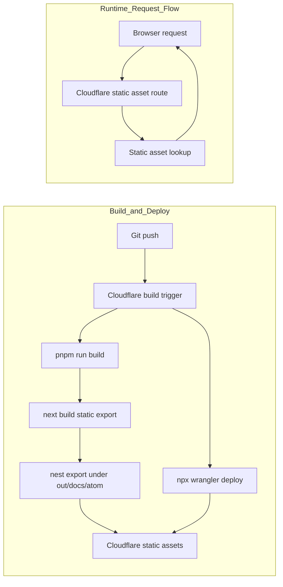

# Atom Docs

Documentation site for Atom, built with Fumadocs and Next.js.

The site is served under `/docs/atom/`.

## Development

```bash
pnpm install
pnpm dev
```

Open http://localhost:3000/docs/atom/ with your browser to see the result.

## Deployment

This site follows the same Cloudflare Workers static-assets pattern used by the FluxMQ docs:

- **Next.js static export** - `next build` outputs static files to `out/`
- **Next.js `basePath`** - links and assets are generated under `/docs/atom`
- **Post-build nesting** - `scripts/nest-static-export.mjs` moves the export under `out/docs/atom/` so Cloudflare static assets can serve it from the route prefix without custom Worker code

### Cloudflare Build Settings

| Setting         | Value                          |
| --------------- | ------------------------------ |
| Build command   | `pnpm run build`               |
| Deploy command  | `npx wrangler deploy`          |
| Version command | `npx wrangler versions upload` |
| Root directory  | `/docs`                        |

### Cloudflare Build Watch Paths

Configure this in the Cloudflare dashboard for the `atom-docs` Worker:

| Setting       | Value    |
| ------------- | -------- |
| Include paths | `docs/*` |
| Exclude paths | empty    |

This keeps the Atom docs Worker from rebuilding when commits only touch files
outside the `docs/` directory.

### Architecture



## Environment Variables

Set this Cloudflare build variable so canonical URLs are embedded into the static output:

```env
NEXT_PUBLIC_BASE_URL=https://www.absmach.eu/docs/atom
```

## Project Structure

| Path                             | Description                             |
| -------------------------------- | --------------------------------------- |
| `app/[[...slug]]/page.tsx`       | Docs page renderer                      |
| `content/docs`                   | MDX source files                        |
| `lib/source.ts`                  | Fumadocs source adapter                 |
| `scripts/nest-static-export.mjs` | Moves static export under `/docs/atom`  |
| `wrangler.jsonc`                 | Cloudflare Workers static-assets config |
